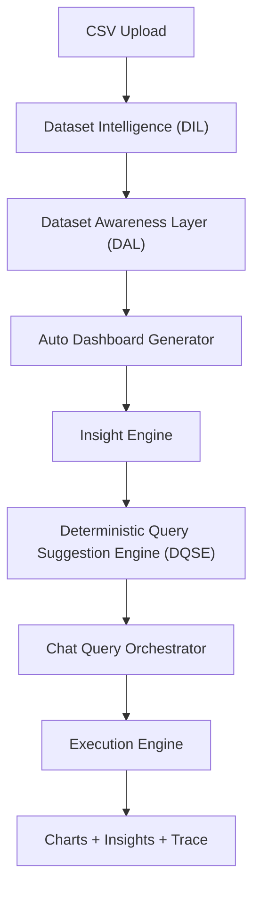

# Talking BI

[](https://www.python.org/downloads/)
[](https://fastapi.tiangolo.com/)
[](#phase-status)

Talking BI is a deterministic analytics system that turns uploaded CSV files into immediate understanding and guided exploration.

It combines:
- dataset awareness
- auto dashboard generation
- deterministic insight extraction
- executable query suggestions
- conversational drill-down querying

## Product Snapshot

### What users get right after upload
1. Dataset summary (shape, semantic columns, quality signals)
2. Auto dashboard (KPI cards + charts)
3. Insight panel (top/low/trend/contribution/anomaly)
4. Suggested queries that are valid for that dataset

### Session modes
- `dashboard`: generate dashboard artifacts only
- `query`: query-first behavior
- `both`: full guided + exploratory experience

## Architecture



## Tech Stack

| Layer | Technology |
|---|---|
| API | FastAPI |
| Runtime | Uvicorn |
| Data engine | pandas |
| Orchestration | deterministic graph + service pipeline |
| UI | static HTML + Plotly |

## Quick Start

```bash
git clone https://github.com/Effec77/TalkingBI.git
cd TalkingBI/talking_bi
python -m venv venv
```

Windows:
```powershell
.\venv\Scripts\Activate.ps1
```

Install dependencies and start:
```bash
pip install -r requirements.txt
copy .env.example .env
uvicorn main:app --host 127.0.0.1 --port 8000 --reload
```

App URL: `http://127.0.0.1:8000`

## API Surface

Base URL: `http://127.0.0.1:8000`

| Endpoint | Method | Purpose |
|---|---|---|
| `/health` | GET | service health |
| `/upload?mode=dashboard\|query\|both` | POST | upload CSV + initialize session artifacts |
| `/query/{session_id}` | POST | execute natural-language query |
| `/suggest?session_id=...&q=...` | GET | deterministic suggestions (prefix-aware) |
| `/suggest/{session_id}?q=...` | GET | path alias for suggestions |
| `/session/{session_id}` | DELETE | end session |
| `/session/{session_id}/status` | GET | inspect session state |
| `/metrics` | GET | global evaluation metrics |
| `/metrics/session/{session_id}` | GET | session-level metrics |

## Upload Contract (Phase 11)

`POST /upload` returns:

```json
{
  "dataset_id": "uuid",
  "columns": {},
  "row_count": 0,
  "profile": {},
  "dataset_summary": {},
  "dataset_summary_text": "",
  "dashboard": {
    "kpis": [],
    "charts": [],
    "insights": []
  },
  "suggestions": []
}
```

## Security and Secret Management

### Rules
1. Never commit `.env`.
2. Keep real API keys out of code, logs, screenshots, and PRs.
3. Use `.env.example` as the public template only.
4. Rotate keys if exposure is suspected.

### Current protections
- `talking_bi/.env` is gitignored.
- Provider integrations read keys from environment variables.
- `talking_bi/.env.example` contains placeholders only.

## Repository Layout

```text
TalkingBI/
  talking_bi/
    api/
    graph/
    models/
    services/
    static/
    tests/
    .env.example
    main.py
    requirements.txt
```

## Validation and Testing

Run focused checks:
```bash
python phase11_test.py
python tests/e2e_production_test.py
```

Additional scenario tests are included:
- `quick_e2e.py`
- `adversarial_test.py`
- `chaos_stress_test.py`

## Notes for Production Hardening

- Current session store is in-memory; use shared storage for multi-instance deployments.
- Add authentication and rate limiting before public exposure.
- Add centralized logging/monitoring for query latency, error rates, and model provider fallback behavior.

