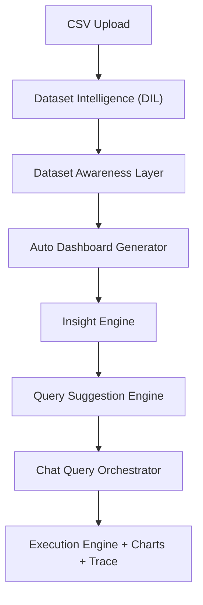

> Legacy module README. For the current professional project documentation, see [`/README.md`](../README.md).

<div align="center">

# 🎯 Talking BI - Phase 0A

### CSV Upload & Session Management Layer

[](https://www.python.org/downloads/)
[](https://fastapi.tiangolo.com/)
[](LICENSE)

*A robust, production-ready backend system for CSV file ingestion and session management*

[Features](#-features) • [Quick Start](#-quick-start) • [API Documentation](#-api-documentation) • [Testing](#-testing) • [Architecture](#-architecture)

</div>

---

## 📋 Overview

**Talking BI Phase 0A** is the foundational layer of a business intelligence system, focusing exclusively on reliable CSV file ingestion and session management. This phase establishes the core infrastructure for data handling without any analytics, LLM integration, or KPI logic.

### What This Phase Does

- ✅ Accepts CSV file uploads via HTTP
- ✅ Validates file format, size, and content
- ✅ Loads data into pandas DataFrames
- ✅ Creates unique sessions with UUID identifiers
- ✅ Extracts comprehensive dataset metadata
- ✅ Manages session lifecycle with automatic expiry
- ✅ Cleans up expired sessions automatically

### What This Phase Does NOT Do

- ❌ No LLM or AI integration
- ❌ No KPI calculations or analytics
- ❌ No LangGraph workflows
- ❌ No SQL querying or database persistence
- ❌ No data visualization or charting

---

## 🚀 Features

### File Upload & Validation
- **Format Validation**: Only `.csv` files accepted
- **Size Limits**: Maximum 10MB per file
- **Content Validation**: Empty files and corrupted data rejected
- **Smart Normalization**: Column names automatically cleaned (lowercase, trimmed)

### Session Management
- **UUID-based Sessions**: Unique identifier for each upload
- **24-Hour Expiry**: Sessions automatically expire after 24 hours
- **Automatic Cleanup**: Background scheduler removes expired sessions every 10 minutes
- **In-Memory Storage**: Fast access with pandas DataFrame storage

### Metadata Extraction
- **Shape Information**: Row and column counts
- **Column Details**: Names, data types, and sample values
- **Data Quality Metrics**: Missing value percentages per column
- **Sample Data**: First 3 unique non-null values per column

---

## 📦 Quick Start

### Prerequisites

- Python 3.12 or higher
- pip package manager

### Installation

1. **Clone the repository**
```bash
git clone <repository-url>
cd talking_bi
```

2. **Create virtual environment**
```bash
python -m venv venv
```

3. **Activate virtual environment**
```bash
# Windows
./venv/Scripts/Activate.ps1

# Linux/Mac
source venv/bin/activate
```

4. **Install dependencies**
```bash
pip install -r requirements.txt
```

5. **Configure environment**
```bash
cp .env.example .env
# Edit .env if needed (defaults are production-ready)
```

6. **Run the server**
```bash
uvicorn main:app --reload
```

The API will be available at `http://localhost:8000`

---

## 🔌 API Documentation

### Base URL
```
http://localhost:8000
```

### Endpoints

#### 1. Health Check
```http
GET /health
```

**Response:**
```json
{
  "status": "healthy"
}
```

---

#### 2. Upload CSV
```http
POST /upload
```

**Request:**
- Content-Type: `multipart/form-data`
- Body: `file` (CSV file)

**Example:**
```bash
curl -X POST http://localhost:8000/upload \
  -F "file=@data/test_data.csv"
```

**Success Response (200):**
```json
{
  "session_id": "653a75a6-8f54-41da-9dcd-8ec59bb7c074",
  "dataset": {
    "filename": "test_data.csv",
    "shape": [10, 5],
    "columns": ["date", "sales", "region", "product", "quantity"],
    "missing_pct": {
      "date": 0.0,
      "sales": 0.1,
      "region": 0.0,
      "product": 0.0,
      "quantity": 0.0
    }
  }
}
```

**Error Responses:**

| Status | Error | Description |
|--------|-------|-------------|
| 400 | Invalid file type | File extension is not `.csv` |
| 400 | CSV file is empty | No data rows in file |
| 400 | Failed to parse CSV | Corrupted or invalid CSV format |
| 413 | File size exceeds limit | File larger than 10MB |

---

## 🧪 Testing

### Run Test Suite

```bash
cd tests
python test_api.py
```

### Test Coverage

- ✅ Health endpoint validation
- ✅ Valid CSV upload and metadata extraction
- ✅ Invalid file type rejection
- ✅ Empty CSV file handling
- ✅ Missing value detection
- ✅ Column normalization

### Sample Test Data

Test CSV files are provided in the `data/` directory:
- `test_data.csv` - Valid sample dataset with 10 rows, 5 columns
- `empty.csv` - Empty CSV for error testing

---

## 🏗️ Architecture

### Project Structure

```
talking_bi/
├── 📁 api/                    # API endpoints
│   ├── __init__.py
│   └── upload.py             # CSV upload endpoint
├── 📁 models/                 # Data contracts
│   ├── __init__.py
│   └── contracts.py          # UploadedDataset dataclass
├── 📁 services/               # Business logic
│   ├── __init__.py
│   └── session_manager.py    # Session lifecycle management
├── 📁 tests/                  # Test suite
│   ├── __init__.py
│   └── test_api.py           # API integration tests
├── 📁 data/                   # Sample data files
│   ├── .gitkeep
│   ├── test_data.csv
│   └── empty.csv
├── 📁 docs/                   # Documentation (future)
├── main.py                    # FastAPI application entry point
├── requirements.txt           # Python dependencies
├── .env                       # Environment configuration (gitignored)
├── .env.example              # Environment template
├── .gitignore                # Git ignore rules
└── README.md                 # This file
```

### Technology Stack

| Component | Technology | Purpose |
|-----------|-----------|---------|
| **Web Framework** | FastAPI 0.109.0 | High-performance async API |
| **Server** | Uvicorn 0.27.0 | ASGI server |
| **Data Processing** | Pandas 2.2.0 | DataFrame operations |
| **File Upload** | python-multipart 0.0.6 | Multipart form handling |
| **Scheduling** | APScheduler 3.10.4 | Background cleanup tasks |
| **Configuration** | python-dotenv 1.0.0 | Environment management |

### Data Flow

```
┌─────────────┐
│   Client    │
└──────┬──────┘
       │ POST /upload (CSV file)
       ▼
┌─────────────────────────────┐
│   FastAPI Upload Endpoint   │
│  - Validate file extension  │
│  - Check file size          │
│  - Parse CSV with pandas    │
└──────┬──────────────────────┘
       │
       ▼
┌─────────────────────────────┐
│   Session Manager           │
│  - Generate UUID            │
│  - Store DataFrame          │
│  - Set expiry timestamp     │
└──────┬──────────────────────┘
       │
       ▼
┌─────────────────────────────┐
│   Metadata Extraction       │
│  - Shape, columns, dtypes   │
│  - Missing value %          │
│  - Sample values            │
└──────┬──────────────────────┘
       │
       ▼
┌─────────────────────────────┐
│   JSON Response             │
│  - session_id               │
│  - dataset metadata         │
└─────────────────────────────┘
```

---

## ⚙️ Configuration

### Environment Variables

Create a `.env` file (use `.env.example` as template):

```bash
# Session Configuration
SESSION_EXPIRY_HOURS=24          # Session lifetime
MAX_FILE_SIZE_MB=10              # Maximum upload size
CLEANUP_INTERVAL_MINUTES=10      # Cleanup frequency
```

### Customization

- **Session Duration**: Modify `SESSION_EXPIRY_HOURS` for longer/shorter sessions
- **File Size Limit**: Adjust `MAX_FILE_SIZE_MB` based on your needs
- **Cleanup Frequency**: Change `CLEANUP_INTERVAL_MINUTES` for more/less frequent cleanup

---

## 🔒 Security

### API Key Protection

- ✅ `.env` file is gitignored
- ✅ `.env.example` provided as template (no secrets)
- ✅ Sensitive configuration never committed

### Best Practices

1. Never commit `.env` files
2. Use `.env.example` for documentation
3. Rotate API keys regularly (for future phases)
4. Validate all user inputs
5. Implement rate limiting (recommended for production)

---

## 🐛 Troubleshooting

### Common Issues

**Issue**: `ModuleNotFoundError`
```bash
# Solution: Ensure virtual environment is activated
./venv/Scripts/Activate.ps1  # Windows
source venv/bin/activate      # Linux/Mac
```

**Issue**: Port 8000 already in use
```bash
# Solution: Use a different port
uvicorn main:app --reload --port 8001
```

**Issue**: File upload fails
```bash
# Check: File size < 10MB, extension is .csv, file is not corrupted
```

---

## 📈 Future Phases

This is Phase 0A - the foundation. Upcoming phases will include:

- **Phase 0B**: Database persistence layer
- **Phase 1**: LLM integration for natural language queries
- **Phase 2**: KPI calculation engine
- **Phase 3**: LangGraph workflow orchestration
- **Phase 4**: Visualization and dashboard

---

## 📄 License

This project is licensed under the MIT License.

---

## 🤝 Contributing

Contributions are welcome! Please follow these steps:

1. Fork the repository
2. Create a feature branch (`git checkout -b feature/amazing-feature`)
3. Commit your changes (`git commit -m 'Add amazing feature'`)
4. Push to the branch (`git push origin feature/amazing-feature`)
5. Open a Pull Request

---

<div align="center">

**Built with ❤️ using FastAPI and Pandas**

[Report Bug](issues) • [Request Feature](issues)

</div>
# Talking BI

[](https://www.python.org/downloads/)
[](https://fastapi.tiangolo.com/)
[](#phase-status)

Deterministic, explainable analytics for CSV datasets.

This section is the canonical README for the current product state (Phase 11).  
The older Phase 0A content below is legacy and should be ignored.

## Phase Status

- Phase 10 complete
- Phase 11 complete:
1. Dataset Awareness Layer
2. Auto Dashboard Generator
3. Insight Engine
4. Deterministic Query Suggestion Engine
5. Session modes (`dashboard`, `query`, `both`)

## Architecture



## Quick Start

```bash
git clone https://github.com/Effec77/TalkingBI.git
cd TalkingBI/talking_bi
python -m venv venv
```

Windows:
```powershell
.\venv\Scripts\Activate.ps1
```

```bash
pip install -r requirements.txt
copy .env.example .env
uvicorn main:app --host 127.0.0.1 --port 8000 --reload
```

## API

Base URL: `http://127.0.0.1:8000`

- `GET /health`
- `POST /upload?mode=dashboard|query|both`
- `POST /query/{session_id}`
- `GET /suggest?session_id={id}&q={prefix}`
- `GET /suggest/{session_id}?q={prefix}`
- `DELETE /session/{session_id}`
- `GET /session/{session_id}/status`
- `GET /metrics`
- `GET /metrics/session/{session_id}`
- `GET /metrics/comparison`

## Upload Response Shape

```json
{
  "dataset_id": "uuid",
  "columns": {},
  "row_count": 0,
  "profile": {},
  "dataset_summary": {},
  "dataset_summary_text": "",
  "dashboard": {
    "kpis": [],
    "charts": [],
    "insights": []
  },
  "suggestions": []
}
```

## Security and Secrets

- `.env` is gitignored and must remain private.
- `.env.example` contains placeholders only.
- API keys are loaded from environment variables at runtime.

Minimum secure practice:
1. Never commit `.env` or raw keys.
2. Rotate compromised keys immediately.
3. Keep keys in a secrets manager for deployed environments.

## Main Components

- `api/`: HTTP boundary and endpoint routing
- `services/dataset_awareness.py`: metadata-first dataset understanding
- `services/dashboard_generator.py`: deterministic upload-time dashboard
- `services/insight_engine.py`: deterministic top/low/trend/anomaly insights
- `services/query_suggester.py`: valid, ranked query suggestions
- `services/dataset_query_engine.py`: SQL-like deterministic query answering
- `graph/`: locked core execution pipeline

## Testing

```bash
python phase11_test.py
python tests/e2e_production_test.py
```

---
