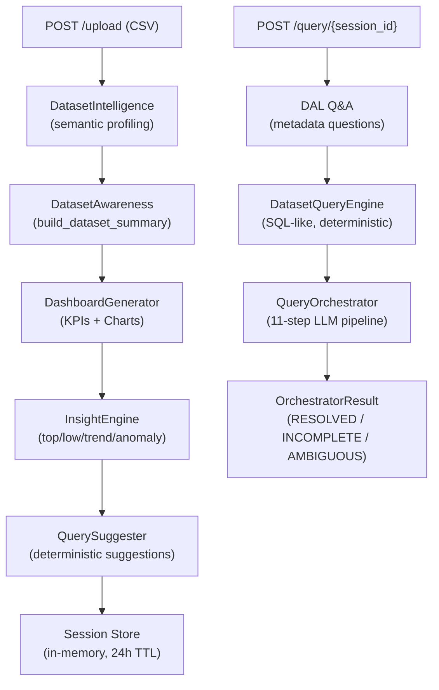

# TalkingBI — Deep Codebase Analysis

## What It Is

TalkingBI is a **deterministic, LLM-optional** analytics backend that turns a CSV upload into a fully live BI session — dashboards, KPI cards, insights, and a conversational chat interface — without requiring a database or BI tool. It runs entirely in-memory via FastAPI + pandas.

---

## Architecture Overview



---

## The 11-Step Query Pipeline (Orchestrator)

The core of TalkingBI is the `QueryOrchestrator.handle()` which processes every query through up to 11 deterministic + semantic + LLM stages:

| Step | Phase | What Happens |
|------|-------|-------------|
| 0 | Cache | Query result cache check (normalized query key) |
| 1 | Session | Load df + metadata from session store |
| 2 | Dashboard | Generate or load `DashboardPlan` (KPI candidates) |
| 2.5 | Preprocess (9C.2) | Deterministic query cleanup (e.g. complete compare/trend) |
| 3 | Normalize (6E) | `QueryNormalizer` — synonym collapse, alias expansion |
| 4 | Override (6G) | `DeterministicIntentDetector` — pattern match before LLM |
| 5 | Parse (6B) | LLM parse (`parse_intent`) — only if 6G didn't match |
| 6 | Semantic (7) | `SemanticInterpreter` — map vague terms to dataset KPIs |
| 7 | Schema Map (6F) | `SchemaMapper` — bind column names, handle ambiguity |
| 8 | Validate | `IntentValidator` — check KPI exists, handle fuzzy fallback |
| 9 | Resolve Context (6C) | `ContextResolver` — inherit KPI/dim from conversation history |
| 10 | Plan + Execute (6D) | `ExecutionPlanner` diff → Pandas backend execution |
| 11 | Record | `Evaluator` records for metrics, return `OrchestratorResult` |

### Query Resolution Priority (before Orchestrator)

1. **DAL Awareness** — "how many columns does this have?" → answered from `dataset_summary`, zero LLM
2. **Dataset Query Engine** — "what is the max revenue?" → deterministic pandas ops, zero LLM
3. **Orchestrator** — full 11-step pipeline with optional LLM fallback

---

## Service Catalog (37 services)

### Core Intelligence
| Service | Role |
|---------|------|
| `dataset_intelligence.py` | Per-column profiling: semantic_type (kpi/date/dimension), cardinality bucket, role_scores |
| `dataset_awareness.py` | Dataset metadata Q&A, human-readable summary |
| `dataset_query_engine.py` | Deterministic "SQL-like" data Q&A without LLM |
| `schema_mapper.py` | Column name fuzzy-matching, ambiguity detection |
| `semantic_interpreter.py` | SEMANTIC_MAP vocab (70+ terms) → dataset KPIs, 0.7 confidence gate |

### Query Processing
| Service | Role |
|---------|------|
| `query_normalizer.py` | Synonym collapse, alias expansion (6E) |
| `deterministic_override.py` | Pattern rules for SEGMENT_BY, FILTER, COMPARE, NOT_NULL (6G) |
| `intent_parser.py` | LLM-powered intent parsing (6B), only fires if 6G fails |
| `intent_validator.py` | Validate KPI/dimension against actual columns |
| `context_resolver.py` | Multi-turn context: inherit KPI/dim from prior turns (6C) |
| `execution_planner.py` | FULL_RUN vs PARTIAL_RUN diff based on intent change (6D) |
| `preprocessor_v2.py` | Pre-pipeline query normalization (9C.2) |

### Execution
| Service | Role |
|---------|------|
| `execution_backend.py` | `PandasBackend` — executes plans over in-memory DataFrames |
| `postgres_backend.py` | `PostgresBackend` — stub, currently disabled (`USE_POSTGRES=False`) |
| `adaptive_executor.py` | Adaptive execution graph (LangGraph-based) |

### Output Generation
| Service | Role |
|---------|------|
| `dashboard_generator.py` | Auto-generate KPI cards + charts from profile |
| `dashboard_planner.py` | Plan dashboard layout and chart types |
| `insight_engine.py` | Top/low/contribution/trend/anomaly insights (deterministic, max 5) |
| `insight_narrator.py` | Human-readable insight text |
| `chart_renderer.py` | Build Plotly chart specs |
| `kpi_generator.py`, `kpi_enrichment.py`, `kpi_selector.py`, `kpi_validator.py` | KPI lifecycle |

### Infrastructure
| Service | Role |
|---------|------|
| `session_manager.py` | In-memory session store, 24h TTL, APScheduler cleanup |
| `conversation_manager.py` | Multi-turn conversation state per session |
| `llm_manager.py`, `llm_client.py` | Multi-provider LLM: Gemini / Groq / Mistral / OpenRouter |
| `evaluator.py` | Per-query metrics recording (latency, intent, status) |
| `cache.py` | Query result cache + LLM cache |

---

## Data Models

### `OrchestratorResult`
The single system-wide response contract for every query:
- `status`: `RESOLVED | INCOMPLETE | UNKNOWN | AMBIGUOUS | ERROR`
- `intent`: `{intent_type, kpi, dimension, filter, kpi_1, kpi_2}`
- `data`, `charts`, `insights`: outputs
- `trace`: full `ExecutionTrace` (for debugging, 20+ fields)
- `latency_ms`, `warnings`, `errors`

### `ExecutionTrace`
Detailed per-stage observability — every pipeline stage stamps its own state into the trace object. This makes debugging production queries very straightforward.

### `UploadedDataset`
Frozen dataclass: `session_id`, `filename`, `columns`, `dtypes`, `shape`, `sample_values`, `missing_pct`.

---

## Strengths

### 1. Determinism-First Design
The system is specifically designed to **minimize LLM usage**. LLM only fires at step 5 (6B) when all deterministic checks fail. This means:
- Predictable latency
- No token costs for common queries
- Testability (same input → same output)

### 2. Multi-tier Query Resolution
The 3-tier resolver (DAL → DQE → Orchestrator) is elegant. Dataset metadata questions never hit the LLM. Simple SQL-like questions never hit the NLP pipeline.

### 3. Execution Planner (FULL/PARTIAL_RUN)
The `IntentDiff`-based planner is sophisticated — it reuses `filtered_df` or `last_result` based on what changed, avoiding redundant computation across conversation turns.

### 4. Multi-turn Conversational Context
`ContextResolver` and `ConversationManager` preserve prior intents so follow-up queries like "by region" correctly inherit the KPI from the previous turn.

### 5. Comprehensive Observability
`ExecutionTrace` with 20+ fields, plus `Evaluator` for session-level and global metrics — this is production-grade instrumentation.

### 6. Extensive Semantic Vocabulary
`SEMANTIC_MAP` covers 70+ business terms across finance, SaaS, HR, marketing, manufacturing, banking, and supply chain — with a principled 0.7 confidence gate preventing false mappings.

### 7. Rich Testing Culture
89+ test files covering unit, integration, adversarial, chaos/stress, and E2E scenarios across all 11 development phases.

---

## Weaknesses & Issues

### 1. In-Memory Session Store — Single Instance Only
```python
SESSION_STORE: Dict[str, Dict] = {}
```
All sessions live in Python memory on one process. The README acknowledges this: "use shared storage for multi-instance deployments." Kubernetes/multi-pod deployment is blocked.

### 2. `USE_POSTGRES = False` (Dead Code)
The Postgres backend path is hardcoded off in the orchestrator:
```python
USE_POSTGRES = False
```
`postgres_backend.py` exists but is never exercised in production, making `psycopg2-binary` and `sqlalchemy` in `requirements.txt` unused weight.

### 3. Session ID Generated Twice in Upload
```python
session_id = str(__import__('uuid').uuid4())  # Generated early (line 109)
...
session_id = create_session(df, dataset)       # Overwritten (line 128)
```
The first UUID is thrown away. This is a harmless but confusing bug.

### 4. run_id Reference Bug in Orchestrator
```python
except Exception as exec_error:
    deregister_df(run_id)  # NameError — run_id is never defined in scope
```
This will throw a `NameError` on execution failure, masking the underlying exception.

### 5. Dashboard Plan Regenerated Every Query
```python
plan = generate_dashboard_plan(session_id=session_id, df=df, uploaded_dataset=metadata)
```
This runs on every query in the orchestrator, even though the dashboard plan doesn't change. There's a `dashboard_plan` field in the session, but `generate_dashboard_plan` always creates fresh.

### 6. LangGraph Dependency Not Used in Main Path
`langgraph==0.2.54` in requirements, and `adaptive_executor.py` (24 KB) exists, but the orchestrator uses `PandasBackend` directly. LangGraph is unused in production paths.

### 7. Static Frontend — No Reactivity
`static/index.html` (34 KB) is a monolithic HTML file. The entire BI UI lives in one file with inline JS. No component framework, no hot-reload, hard to maintain.

### 8. No Authentication or Rate Limiting
README acknowledges: "Add authentication and rate limiting before public exposure." Session IDs are UUIDs without any auth — any UUID guess exposes data.

### 9. Thread Safety
`SESSION_STORE` is a plain Python dict. uvicorn runs async workers but if ever deployed with multiple sync threads, the session store would have race conditions.

### 10. `MAX_FILE_SIZE_MB=10` + `MAX_ROWS=100,000`
These limits are hardcoded via env. A 10 MB CSV with 100,000 rows is moderate; no chunked loading is supported.

---

## Tech Debt Hotspots

| File | Size | Issue |
|------|------|-------|
| `orchestrator.py` | 804 lines | Does too much — mixing control flow with inline business rules |
| `nodes.py` (graph/) | 34 KB | Large execution node definitions |
| `adaptive_executor.py` | 24 KB | Largely unused in main path |
| `context_resolver.py` | 21 KB | Complex but untested in adversarial scenarios |
| `tests/` | 89 files | Many patch-script files (apply_*.py, fix_*.py, rewrite_*.py) are one-off patching artifacts left in the test folder |

---

## Improvement Recommendations

### High Priority
1. **Fix `run_id` NameError** in orchestrator's execution exception handler (line ~597).
2. **Cache the dashboard plan** per session — compute once on upload, read from `session["dashboard_plan"]` in subsequent queries.
3. **Remove the duplicate UUID** generation in `upload.py` (lines 109 vs 128).

### Medium Priority
4. **Replace SESSION_STORE with Redis** for horizontal scale. The session schema is already serialization-friendly (except the `df` — serialize as Parquet or feather).
5. **Split orchestrator.py** into sub-modules: `pipeline_steps.py`, `result_builders.py`, `trend_handler.py` — the current 804-line single class is hard to unit-test cleanly.
6. **Remove or activate Postgres backend** — either wire it up or remove `postgres_backend.py`, `psycopg2-binary`, and `sqlalchemy` to reduce dead weight.
7. **Move tests/apply_*.py, rewrite_*.py, fix_*.py** to `archive/` — they pollute the test folder and confuse CI (89 test files, many are one-off migration scripts).

### Low Priority
8. **Add API key auth** — even a simple static bearer token (`X-API-Key` header) blocks trivial session enumeration.
9. **Migrate frontend to a component framework** (React or Vue) — the 34 KB monolithic HTML with inline JS will not scale as features grow.
10. **Document `SEMANTIC_MAP`** with the domains it covers and the process for adding new terms, to enable community contribution.

---

## Tech Stack Summary

| Layer | Technology | Notes |
|-------|-----------|-------|
| API | FastAPI 0.109 | Clean router separation |
| Runtime | Uvicorn | Async, single instance |
| Data Engine | pandas 2.2 | In-memory, no SQL |
| LLM: Primary | Gemini Pro | Via `google-generativeai` |
| LLM: Fallback | Groq, Mistral, OpenRouter | Multi-provider pool |
| Orchestration | Custom graph + LangGraph | LangGraph currently unused in main path |
| Session | APScheduler + in-memory dict | 24h TTL, no persistence |
| Charts | Plotly specs (JSON) | Rendered by frontend |
| Frontend | Single-file HTML + JS | Plotly.js charts |
| DB (stub) | PostgreSQL via SQLAlchemy | Present but disabled |

---

## Phase History

The codebase went through 11 explicit development phases:
- **Phase 0A/0B**: MVP upload + dashboard generation
- **Phases 2–5**: Query parsing, intent classification, normalization
- **Phase 6 (A–G)**: Full pipeline: normalize → override → parse → schema → context → execute
- **Phase 7**: Semantic vocabulary mapping
- **Phase 8**: Evaluator + metrics
- **Phase 9 (A–C)**: Production hardening, confidence scoring, query cache, multi-provider LLM, context-aware preprocessing
- **Phase 10**: Product layer (full UI, session modes, suggestions)
- **Phase 11**: Dataset Awareness Layer + Dataset Query Engine (deterministic metadata Q&A)
