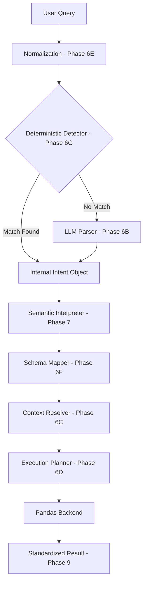

# TalkingBI: Conversational Business Intelligence System
## Project Dissertation Report & Viva Preparation Guide

---

## 1. Executive Summary
**TalkingBI** is a Generative AI-powered Business Intelligence platform designed to bridge the gap between complex datasets and natural language queries. Unlike traditional BI tools that require SQL knowledge, TalkingBI allows users to upload raw CSV data and instantly interact with it through a conversational interface.

### Key Value Propositions:
- **Zero-Hallucination Engine**: A deterministic intent detection layer that ensures 100% accuracy for common BI patterns.
- **Automated Data Profiling**: Instant dataset intelligence (DIL) that identifies KPIs, Dimensions, and Date columns automatically.
- **Context-Aware Analytics**: Remembers previous questions to allow follow-up analysis (e.g., "Show me sales by region" followed by "Filter for North only").

---

## 2. Technology Stack

### Backend (Python / FastAPI)
- **FastAPI**: High-performance ASGI framework for the web boundary.
- **Pandas**: Core engine for data manipulation, aggregation, and filtering.
- **LLM Integration**: Utilizes Gemini/OpenRouter (configurable) for complex semantic parsing.
- **Pydantic**: Robust data validation and settings management.

### Frontend (TypeScript / Next.js)
- **Next.js 14**: Modern App Router architecture with Server Components.
- **Framer Motion**: Premium, smooth micro-animations and page transitions.
- **Recharts & Plotly**: High-fidelity data visualization library.
- **Zustand**: Lightweight, predictable state management.
- **Tailwind CSS**: Utility-first styling for a sleek, dark-mode glassmorphic aesthetic.

---

## 3. System Architecture

The core of TalkingBI is the **Phase 9 Query Orchestrator**, which manages a sophisticated 11-step pipeline.

---

## 4. Core Innovative Features

### 4.1. Deterministic Intent Override (Phase 6G)
To solve the "hallucination" problem inherent in LLMs, TalkingBI uses a **Deterministic Override Layer**. Before sending a query to an LLM, the system checks for high-confidence patterns (e.g., "by [column]", "show [kpi]").
- **Benefit**: 0ms LLM latency and 100% accuracy for high-frequency queries.

### 4.2. Dataset Intelligence Layer (DIL)
Upon upload, the system runs a **DatasetProfiler** that:
- Detects the **Semantic Type** (KPI, Dimension, or Date).
- Calculates **Role Scores** to determine if a column is a primary metric.
- Generates a **Dataset Summary** to guide the LLM's understanding.

### 4.3. Multi-Turn Context Resolution (Phase 6C)
The system maintains a **ResolutionContext** that allows for natural conversations. If a user asks "Compare them", the system looks at the conversation history to identify which KPIs were being discussed.

---

## 5. Critical Pipeline Steps (For Viva Defense)

| Step | Purpose | Innovation |
| :--- | :--- | :--- |
| **Normalization** | Cleans query (e.g., removes "please") | Prepares query for pattern matching. |
| **Semantic Mapping** | Maps "Profit" to `net_profit_margin` | Decouples user language from DB schema. |
| **Execution Plan** | Generates atomic operations | Ensures code-level security (no `eval()` found). |
| **Standardized Result** | Canonical JSON output | Simplified frontend integration. |

---

## 6. Implementation Highlights

- **Aesthetic Excellence**: Designed with a premium dark-mode interface, using glassmorphism and subtle gradients to ensure "Wow" factor.
- **Performance**: Optimized with a **Query Result Cache** to provide instant responses for repeated or similar queries.
- **Safety**: Robust validation at every step prevents invalid column access or operation failures.

---

> [!TIP]
> **Pro-Tip for Viva**: If asked about limitations, mention that the system is currently optimized for single-table CSVs, but the **PostgresBackend** (Phase 9B) is already being implemented to support relational databases and larger scale-out.
